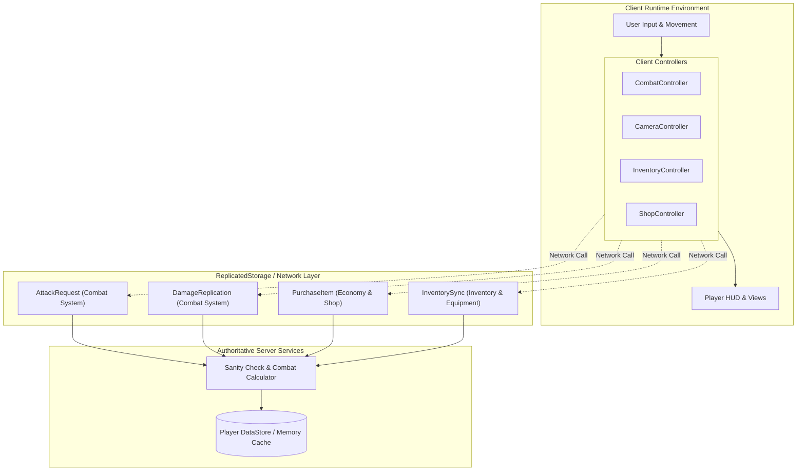
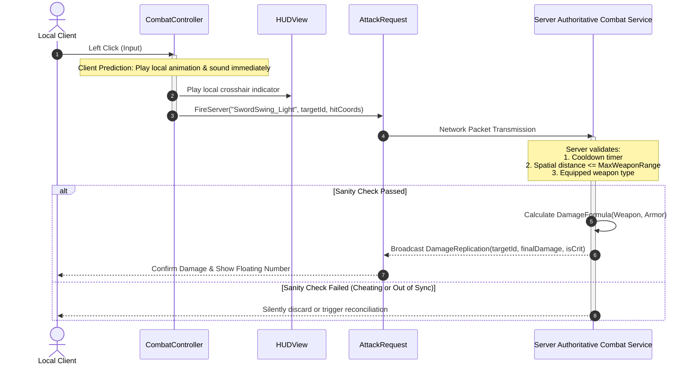

# 🎓 Educational Architecture & Mechanics Report: Realm of Blades (Action RPG)
*Generated from LuauLens Analysis Snapshot | PlaceId: 891240182 | PlaceVersion: 42*

## 1. High-Level Architecture & Frameworks
- **Identified Framework(s):** **Knit** (High confidence)
- **Total Client Scripts Analyzed:** 12
- **Network Remote Endpoints:** 4

### Architecture Flow Diagram


## 2. Client Component Decomposition
### Controller (2 modules)
*Coordinates player attack inputs, local weapon animation, and client prediction*

| Script Name | Class | Location | Educational Role |
| --- | --- | --- | --- |
| `CombatController` | ModuleScript | `game:GetService("Players").LocalPlayer.PlayerScripts.Controllers.CombatController` | Coordinates player attack inputs, local weapon animation, and client prediction |
| `CameraController` | ModuleScript | `game:GetService("Players").LocalPlayer.PlayerScripts.Controllers.CameraController` | Over-the-shoulder action camera and target locking system |

### Game Mechanic (2 modules)
*Coordinates client inventory slots, item hotbar, and equipment state*

| Script Name | Class | Location | Educational Role |
| --- | --- | --- | --- |
| `InventoryController` | ModuleScript | `game:GetService("Players").LocalPlayer.PlayerScripts.Controllers.InventoryController` | Coordinates client inventory slots, item hotbar, and equipment state |
| `ShopController` | ModuleScript | `game:GetService("Players").LocalPlayer.PlayerScripts.Controllers.ShopController` | Handles merchant window rendering, transaction requests, and price preview |

### Network Adapter (1 modules)
*Centralized RemoteEvent / RemoteFunction wrapper with automatic retry and type safety*

| Script Name | Class | Location | Educational Role |
| --- | --- | --- | --- |
| `NetworkClient` | ModuleScript | `game:GetService("ReplicatedStorage").Common.Network.NetworkClient` | Centralized RemoteEvent / RemoteFunction wrapper with automatic retry and type safety |

### UI Component (2 modules)
*Health bar, stamina bar, and action cooldown indicators*

| Script Name | Class | Location | Educational Role |
| --- | --- | --- | --- |
| `HUDView` | LocalScript | `game:GetService("Players").LocalPlayer.PlayerGui.HUD.HUDView` | Health bar, stamina bar, and action cooldown indicators |
| `InventoryView` | LocalScript | `game:GetService("Players").LocalPlayer.PlayerGui.InventoryGui.InventoryView` | Grid layout for bag items and equipment slots |

### State Store (1 modules)
*Local replicated state container holding current health, gold, and active buffs*

| Script Name | Class | Location | Educational Role |
| --- | --- | --- | --- |
| `PlayerStateStore` | ModuleScript | `game:GetService("ReplicatedStorage").Common.State.PlayerStateStore` | Local replicated state container holding current health, gold, and active buffs |

### Utility & Helper (2 modules)
*High-performance event signal emitter*

| Script Name | Class | Location | Educational Role |
| --- | --- | --- | --- |
| `Signal` | ModuleScript | `game:GetService("ReplicatedStorage").Packages.Signal` | High-performance event signal emitter |
| `Trove` | ModuleScript | `game:GetService("ReplicatedStorage").Packages.Trove` | Lifecycle cleanup manager for connections and temporary instances |

### Config & Data (2 modules)
*Static catalog of weapon stats, rarity tiers, and icon asset IDs*

| Script Name | Class | Location | Educational Role |
| --- | --- | --- | --- |
| `ItemDefinitions` | ModuleScript | `game:GetService("ReplicatedStorage").Common.Configs.ItemDefinitions` | Static catalog of weapon stats, rarity tiers, and icon asset IDs |
| `CombatFormulas` | ModuleScript | `game:GetService("ReplicatedStorage").Common.Configs.CombatFormulas` | Mathematical formulas for armor mitigation and critical strike chance |

## 3. Entity-Component System & Tags (CollectionService)
The experience uses tag-driven component binding for game entities:

| Component Tag | Instances | Class Distribution | Educational Purpose |
| --- | --- | --- | --- |
| `DamageHitbox` | 32 | Part (32) | Component tag applied to melee & projectile collision boxes for dynamic detection |
| `InteractableChest` | 14 | Model (14) | ProximityPrompt trigger binding for loot chest interaction |
| `ShopNPC` | 5 | Model (5) | Bound to merchant dialog and store interaction controller |

## 4. Network Remote Contracts & Security Analysis
| Remote Name | System | Total Calls | Observed Signatures | Security Considerations |
| --- | --- | --- | --- | --- |
| `AttackRequest` | Combat System | 84 | `(string, number, table)` | ⚠️ **Critical:** Server must validate distance, cooldowns, and compute actual damage |
| `DamageReplication` | Combat System | 42 | `(number, number, boolean)` | ⚠️ **Critical:** Server must validate distance, cooldowns, and compute actual damage |
| `PurchaseItem` | Economy & Shop | 6 | `(string, number)` | 🔒 **Strict:** Never accept client prices; validate gold balances server-side |
| `InventorySync` | Inventory & Equipment | 12 | `(table)` | 📦 **Atomic:** Server must handle inventory transactions atomically |

## 5. Interaction Sequence Diagram (Client Prediction & Server Authority)


## 6. Generated Tutorial: Implementing Secure Networking in Luau
```lua
-- [TUTORIAL] Authoritative Combat Remote Handler
local ReplicatedStorage = game:GetService("ReplicatedStorage")
local AttackRemote = ReplicatedStorage:WaitForChild("AttackRequest")

local MAX_ALLOWED_DISTANCE = 15 -- Studs
local COOLDOWN_SECONDS = 0.6
local lastAttackTimes = {}

AttackRemote.OnServerEvent:Connect(function(player, attackType, targetCharacterId, hitPosition)
    local character = player.Character
    if not character or not character:FindFirstChild("Humanoid") or character.Humanoid.Health <= 0 then
        return -- Dead or invalid character cannot initiate attacks
    end

    -- 1. Anti-spam & Cooldown check
    local now = os.clock()
    local lastTime = lastAttackTimes[player] or 0
    if (now - lastTime) < COOLDOWN_SECONDS then return end
    lastAttackTimes[player] = now

    -- 2. Spatial distance check
    local targetCharacter = workspace:FindFirstChild(tostring(targetCharacterId))
    if not targetCharacter or not targetCharacter:FindFirstChild("HumanoidRootPart") then return end

    local distance = (character.HumanoidRootPart.Position - targetCharacter.HumanoidRootPart.Position).Magnitude
    if distance > MAX_ALLOWED_DISTANCE then return end

    -- 3. Compute authentic damage on server
    local damage = 35
    targetCharacter.Humanoid:TakeDamage(damage)
end)
```